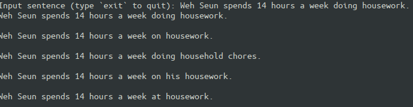

# T5 Paraphrasing Experiments

## Environment

- Python 3.8.3
- PyTorch 1.5
- Transformers 2.11.0
- nltk 3.2.5

## Datasets

- [PAWS: Paraphrase Adversaries from Word Scrambling](https://github.com/google-research-datasets/paws)
- [Quora Question Pairs](https://www.quora.com/q/quoradata/First-Quora-Dataset-Release-Question-Pairs)

The datasets are put into the `/data/` folder. Please refer to preprocessing script (for now) for the sub-folder namings of the PAWS dataset.

## Instructions

### Preprocessing Steps

These two scripts will normalize the data and create train/valid/test split:

```bash
python preprocessing/preprocess_quora.py
python preprocessing/preprocess_paws.py
```

Pre-tokenize the dataset:

```bash
python preprocessing/tokenize_dataset.py quora
python preprocessing/tokenize_dataset.py paws
```

### Training

Example:

```bash
python train_t2t.py --amp-level O1 --steps 80000 --dataset quora+paws --batch-size 8 --grad-accu 2 --max-len 64
```

Use `python train_t2t.py --help` to see available options.

## Pre-trained Model

A pre-trained model trained on both PAWS and Quora datasets [is published on Huggingface Model Hub](https://huggingface.co/ceshine/t5-paraphrase-quora-paws). You can use the model to paraphrase sentences by running the following command:

```bash
python generate.py ceshine/t5-paraphrase-quora-paws --num-outputs 5
```


